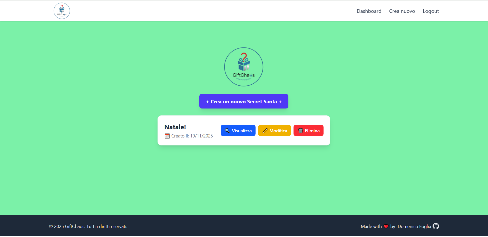
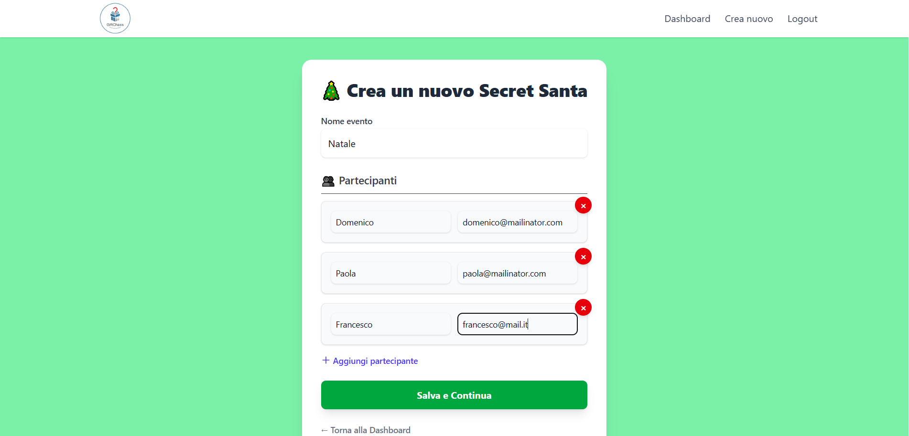

# GiftChaos - Secret Santa Organizer

GiftChaos è un'applicazione web per organizzare facilmente eventi di **Secret Santa**, gestendo partecipanti, regali e estrazioni casuali. Realizzata con **Laravel** e **Tailwind CSS**, offre un'interfaccia semplice e moderna per creare e gestire i tuoi Secret Santa.

---

## 🔹 Funzionalità principali

- Creazione di eventi Secret Santa personalizzati
- Gestione dei partecipanti (aggiunta, modifica, rimozione)
- Estrazione casuale dei regali senza duplicati
- Dashboard per visualizzare tutti i Secret Santa creati
- Notifiche di conferma per azioni come eliminazione o modifica
- Design responsive con Tailwind CSS

---

## 💻 Tecnologie utilizzate

- [Laravel](https://laravel.com/) - Framework PHP MVC
- [Tailwind CSS](https://tailwindcss.com/) - Utility-first CSS framework
- [PHP 8+](https://www.php.net/)
- [MySQL](https://www.mysql.com/) 

---

## 🎨 Stile e UI

- Tailwind CSS per il design moderno e responsive  
- Logo personalizzato in formato PNG  
- Dashboard centrale con pulsanti ben visibili e schede per ogni Secret Santa  
- Footer con copyright e link al profilo GitHub del creatore  

### Screenshots

  

---

## 🔗 Link utili

- Profilo GitHub: [DomenicoFoglia](https://github.com/DomenicoFoglia)  
- Documentazione Laravel: [https://laravel.com/docs](https://laravel.com/docs)  
- Tailwind CSS: [https://tailwindcss.com/docs](https://tailwindcss.com/docs)  

---

## 🧑‍💻 Autore

**Domenico Foglia**  
[GitHub](https://github.com/DomenicoFoglia)